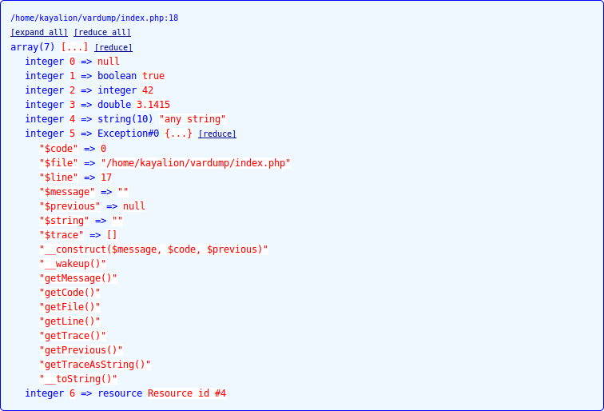
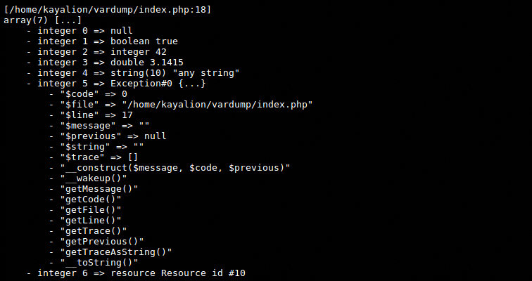

# VarDump

PHP Helper library to print variables for debugging purposes.

## Usage

```php
<?php

// when you use Composer, this is not necessairy
include __DIR__ . '/src/VarDump.php';

// prints a variable
d("any variable");

// or multiple variables, as many as your memory can handle
d("any variable", "any other variable");

// prints a variable and exits
dd("any variable");

// or with multiple variables
dd("any variable", "any other variable");

// prints one variable with a specific dump configuration
$maxRecursiveDepth = 10;
$maxStringLength = 100;
$theme = new HulkHtmlVarDumpTheme();

dc("any variable", $maxRecursiveDepth, $maxStringLength, $theme);

// as called for the sample the screenshots
d([
    null,
    true,
    42,
    3.1415,
    "any string",
    new Exception(),
    fopen('php://stdout', 'w'),
]);
```

## Configuration

You can use the environment variable to configure the vardump.

```php
<?php

// Maximum depth for arrays and objects
$_ENV['VAR_DUMP_RECURSIVE_DEPTH'] = 10;

// Maximum length for the preview of a string
$_ENV['VAR_DUMP_STRING_LENGTH'] = 100;

// Name of the CLI theme class, only one implemented
$_ENV['VAR_DUMP_THEME_CLI'] = 'CliVarDumpTheme';

// Name of the HTML theme class, choose between:
// - HtmlVarDumpTheme
// - BatmanHtmlVarDumpTheme
// - HulkHtmlVarDumpTheme,
// - IronmanHtmlVarDumpTheme,
// - SpidermanHtmlVarDumpTheme,
// - SupermanHtmlVarDumpTheme,
$_ENV['VAR_DUMP_THEME_HTML'] = 'SpidermanHtmlVarDumpTheme';
```

## Screenshots

Output on a HTML page:


Output in a CLI:


## Installation

You can use [Composer](http://getcomposer.org) to install this helper into your project.

```
composer require kayalion/vardump
```
